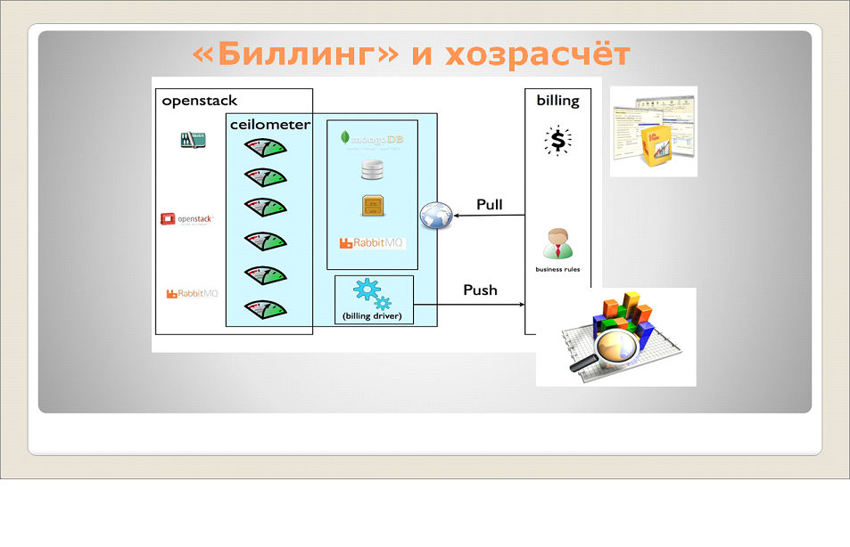

# DevOps для 1С, или мы все теперь инженеры бизнес-приложений

**Данный доклад был подготовлен специально для конференции Infostart Event Connection. То, о чем я буду сейчас говорить, делает максимум 10 компаний в мире. В России это делают компании уровня Альфа-банка и СберТеха. Казалось бы, это – космос, но я попробую вас к этому космосу приблизить и рассказать, почему это важно начать делать именно сейчас.**

Представьте себе, **что никаких ролей больше нет**:
Среди вас есть менеджеры проектов? Представьте, что вы больше не менеджеры, вы – инженеры бизнес-приложений. Работаете в IT – значит, инженеры.
Разработчики есть? Вы – тоже инженеры бизнес-приложений.
И я, казалось бы, технический директор, тоже инженер бизнес-приложений.
Даже если кто-то из вас – реальный бизнес-заказчик, все равно, раз вы как-то связаны с IT – вы тоже немного инженер бизнес-приложений.

## Примерная структура IT-управления. «Стратегия отказов» в IT


На слайде показана **примерная структура IT-управления некой стандартной компании**. Практически в любой организации существует подобная структура, в ее состав входит:

- **Отдел анализа** – это может быть группа анализа или просто бизнес-аналитик, который анализирует бизнес, пишет документы, рисует Visio-диаграммы, участвует в SharePoint – портале и т.д.
- Кроме этого, существует **отдел разработки 1С**. Они что-то проектируют на СППР, пишут код в конфигураторе и т.д.
- Еще где-то рядом сидят **веб-разработчики**. В большинстве случае они живут отдельно от разработчиков 1С, что-то пишут на Javascript, node.js и т.д.
- Также существует **отдел промышленной разработки** – там сидят люди, которые программируют на R, Clojure или еще каких-то других языках (например, на MathLab – он тоже в целом является фреймворком для построения). Короче, занимаются всякой интересной математикой, например, разрабатывают BI. У них отдельный отдел, никакого отношения к 1С не имеющий, потому что они занимаются всякими «волшебными штуками», а 1С-ники – от сохи.
- Кроме этого существует **отдел инфраструктуры**, там сидят некие админы, которые что-то там правят, настраивают сервера.
- И еще есть **отделы поддержки**, которые обычно делятся на три отдела: **Группа поддержки 1С, Отдел поддержки Web-приложений и Отдел поддержки пользователей.**


И все заняты. Чем? Все совещаются. Среднее время выпуска функциональности при подобной конструкции – 145 дней. Это – реальная цифра. Представьте себе, что одна кнопка в 1С-конфигурации из-за этого хаоса отделов выпускается за 145 дней. Понятно, что какую-то мелкую кнопку можно выпустить за неделю, но что-то другое реально выпускается за год.


Почему так сложилось? Потому что **традиционно в IT существует «стратегия отказов»**, когда все IT-департаменты, организованные по стандартной схеме, состоящей из восьми конструкций, фактически работают «на отказ».

Когда заказчик приходит в отдел сбора требований и что-то просит, ему говорят: «сначала идите, сформулируйте требование, заплатите денег, тогда мы напишем ТЗ». Так ведь? **Волшебная стена, которую «не пробить».**
Если заказчик обладает психомассой и деньгами, он пробивает эту стену. Тогда в отделе сбора требований начинается пожар – нужно срочно что-то написать разработчикам.
А что делают разработчики, когда к ним приходят бизнес-аналитики? Они говорят им: «ТЗ не полное, идите, уточняйте». Правильно же? Естественно, правду вам никто не скажет. Разработчики скажут: «мы вообще-то лояльные, просто у нас отдел бизнес-анализа плохой».
Но если отдел бизнес-анализа, опять же, обладает психомассой и принятыми от заказчика деньгами, они пробивают эту стену, и тогда пожар начинается у разработчиков – им срочно надо что-то разрабатывать.
А когда разработчики приносят продукт, который надо развернуть у клиента инфраструктурщикам (это может быть отдел сопровождения или отдел эксплуатации – у кого как называется), происходит то же самое. Что они говорят: «недостаточно описано, нет документации пользователя». Классически же?
И потом все злые.
**На текущий момент, в 2015 году в мире это признано неуспешной практикой**, поэтому сейчас менеджеров учат никогда ничего не обещать, а много просить: «предоставьте мне, иначе я не начну работать»; и много предлагать – все начинают «мозгоштурмить», говорить: «добавьте вот это и вот это, а я еще видел…»

## Теоретические основы сложившейся ситуации


Откуда ноги растут? **Ключевую роль в этой ситуации играют используемые компанией стандарты.**
Например, инфраструктурщики считают, что на них действует стандарт ITIL v2. Стандарт ITIL v2 выглядит вот так – как дом.
А знаете, как выглядит новый стандарт – ITIL v3? Он выглядит вот так:


**Никто ничего не стабилизирует, нет больше «дома», есть постоянное наращивание качества.** По-английски это называется Continual Service Improvement (постоянное наращивание качества). Быстро, в течение суток – все время качественнее, лучше, больше и т.д.


Правда, похоже на картинку итеративной разработки по Agile? Они там это уже прошли. Сейчас, в 2015 году вместо него используется ScalableAgile. Знаете, как он выглядит? Он выглядит вот так:


Берем бюджет и постоянно приносим пользу. Это называется Value Stream – становимся на «поезд разработки» и «пилим бюджет» вперед. В качестве остановок – релизы.
А те, кто работает по старой версии ITIL v2 и Agile, наверное, и сервис-деск организуют вот таким образом:


Классическая схема – тоже дом. Пользователь подал тикет, сервис-деск его рассмотрел, после этого «волшебные инфраструктурщики» внесли доработки по этому тикету, передали эти доработки сервис-деску, а сервис-деск пользователям.
А знаете, как выглядит сервис-деск сейчас, в 2015 году? Вот так:


**Собираем, исследуем, выбираем, улучшаем. И так постоянно.**


Вот это – важный слайд. Запомните и своим IT-директорам отвезите:
- ITIL v3 – это конвейер повышения качества.
- ScalableAgile – это конвейер получения пользы, причем именно бизнес-пользы.
- SocialServiceDesk – это основа сервис-деска, конвейер самообслуживания и обучения. Это когда пользователи сами друг друга консультируют. Вы запускаете внутреннюю социальную сеть (EnterpriceSocial), а инженер сервис-деска с высоты своего опыта (он же инженер, много денег получает) чуть-чуть консультирует всю эту «движуху» среди пользователей.
- И, наконец, DevOps – именно о нем мы сейчас и поговорим. Это – конвейер коммуникации между сотрудниками, причем, именно IT-коммуникаций.

## Основы DevOps для 1С


Перейдем от теории к практике. Итак, **что такое DevOps для 1С**?
Возьмем любого разработчика, любого менеджера. Напомню, что и тот, и другой – инженеры бизнес-приложений, девопсеры. Что должен сделать каждый из них, как девопсер?

- Во-первых, **он должен разработать свою конфигурацию 1С «по-правильному»**. Это значит, что в процессе разработки он всегда должен описывать сценарии поведения по методике BDD.
- Следующим шагом он обязательно должен **встроить в 1С сервис не на 1С**. Например, если его конфигурация не содержит интеграции с Mandrill, MailChimp или каким-нибудь другим облачным сервисом, значит, у него плохая конфигурация.
- Потом он должен **развернуть свою конфигурацию в облаке**. Причем, развернуть автоматически, а это значит, что никто ничего не должен нажимать мышкой.
- После этого развернуть мониторинг;
- Включить «портал поддержки»;
- И обработать требования.

Самая главная «фишка» – **это должен сделать один человек**. Нельзя никого звать, нельзя идти к инфраструктурщикам. Разрабатываете конфигурацию – будьте любезны сделать все сами. Путь на низком уровне качества, но сами.
Разумеется, **это возможно только в том случае, если все эти действия будут автоматизированы.** Только так вы сможете стать эффективным IT-специалистом.

## Критерии эффективности IT-специалистов


Теперь давайте разберемся, **что такое «эффективный IT-специалист» в 2015 году?**
Эффективный IT-специалист (будь он 1С-ник или не 1С-ник – неважно), умеет делать следующее:

- **Он знает один методологический блок бизнеса** – либо финансы, либо WMS, либо розницу. Но этот блок он знает очень хорошо и глубоко.
- **Он знает какой-нибудь скриптовый язык**:
  - Либо OneScript;
  - Либо Powershell;
  - Либо Python;
  - Либо Bash;
  - Либо Go.

- Он умеет писать код. На чем угодно:
  - Либо на 1С;
  - Либо на C# (mono);
  - Либо на C++;
  - Либо на Clojure (LISP).
               

- Использует **vagrant, docker, ansimble, chef, puppet** и другие волшебные автоматизированные инструменты.


И тогда все 8 отделов предприятия работают по одной схеме. Количество outlook-переписки нулевое. Никто не переписывается с помощью outlook, все переписываются кодом:
* Бизнес-аналитик пишет требования кодом.
* Разработчики, понятное дело, пишут на 1С.
* Люди, автоматизирующие сборку и развертывание конфигураций, пишут скрипты на Python (либо на чем-то другом – неважно).
* Потом ребята-инфраструктурщики пишут на go, чтобы все это контейнеризировать и развернуть в Docker.
* И потом для обслуживания этих контейнеров также используется Python (в частности, OpenStack – на Python, для VMWare есть специальный SDK, у кого Azure – там тоже есть свои скрипты). Главное – все автоматически.

На этом теоретическая часть закончена. Теперь давайте разберемся в том, почему это действительно эффективно и удобно для бизнеса. Напоминаю, что то, о чем я вам сейчас расскажу, в России почти никто пока не делает (только 2-3 компании), но на этот подход перешли уже, насколько я знаю, Альфа-банк (у них есть успешный опыт) и СберТех. Как это работает?

## Практические примеры

### Загрузка в УТ данных из Yandex Market


Итак, у вас поступает бизнес-задача – загрузка данных с Yandex Market в базу УТ. Какое решение вы выберете? Есть классическое решение – скачать обработку на Инфостарте за 2 тысячи. Это решение работает, но с ним могут возникнуть проблемы.
Нужно поступить так:
- Поставить **Apache**.
- Рядом с Apache поставить **Nginx**.
- Дальше внезапно возникает **ZatoESB** – это маленькая бесплатная шина ESB, которая запускается одной кнопкой – раз! - и у вас шина.
- После этого нужно зайти на **tech.yandex.ru**:

1. Внутри сервиса ZatoESB указать python-скрипт, реализующий интеграцию с API Yandex.
1. Настроить один входящий канал для забора данных (он делается с помощью ZatoESB одной строчкой кода).
1. Также реализовать один исходящий канал, который будет отправлять данные в 1С через веб-сервис, реализованный по протоколу odata. Поднятие такого веб-сервиса в 1С занимает не больше минуты.
1. Потом внутри сервиса ZatoESB создать одно регламентное задание (то задание, которое будет отвечать за интеграцию).
1. И настроить одну очередь для повторного использования на сайте.

**В итоге, загрузка данных с Yandex Market в УТ будет проходить через проксирующий сервис под названием ZatoESB.**

Что такое вообще шина ESB? Это такой специализированный инструмент, который нужен для интеграции одной кучи API с другой кучей API. Такая шина может стоить 5 миллионов долларов, но есть простое, бесплатное решение, которое называется ZatoESB. Спасибо нашим львовским товарищам, которые нам его год назад показали. Это – простая шина на python, которую можно запустить одним кликом.

Понятно, в чем эффективность такого архитектурного решения?

- Пока вы возьмете обработку с Инфостарта, пока вы ее встроите в свою конфигурацию – это время.
- А на github есть много примеров интеграции с API Yandex, реализованных на python. Достаточно всего лишь опубликовать такой скрипт в сервисе ZatoESB, и на стороне 1С поднять Apache, nginx и odata.

Напоминаю, что вы – инженеры. Вам нельзя писать только на 1С. Вы берете весь комплекс сервисов, которые сейчас есть на рынке, и запускаете их. Это запускается за час. Если оно вдруг где-то упало, достаточно чуть-чуть поправить код, и оно заработает, и даже станет чуть-чуть лучше. Не забывайте, нужно постоянно наращивать качество: опубликовали код на github, кто-то к вам присоединился, вы с кем-то поделились. Понимаете, как все это работает? Это – постоянное улучшение качества.

А если вас беспокоит вопрос «а вдруг оно упадет?» – да все всегда обязательно упадет. Это надо просто запомнить.

Используя шину ZatoESB, вы получаете неоспоримое преимущество, поскольку в ней осуществляется валидация JSON, хранение API key, управление сервисами и их версионированием, а также всякие другие интересные интеграционные возможности, которые вы на 1С будете реализовывать месяца три. **Фактически, ZatoESB скрывает ваши риски о тех понятиях, которые вы даже не знаете.** Вы просто ее устанавливаете, начинаете писать, и о рисках уже не думаете. Абстракции еще потекут, но они потекут потом.

### Полнотекстовый поиск в документах 1С:Документооборот


Давайте рассмотрим другой пример: необходимо для конфигурации 1С:Документооборот реализовать полнотекстовый поиск внутри документов, которые прикреплены к процессам. У нас там лежит куча файлов (pdf, doc и т.д.), по которым нужно искать информацию. За сколько вы реализуете такую задачу? Я – за час. Как это сделать за час:

Берем 1С:Документооборот КОРП, добавляем в его конфигурацию обработку поиска по файлам, рисуем в ней формочку, размещаем там поле ввода с заголовком «Документы содержат текст» и кнопку «Найти».

Для реализации задачи нужен сервис под названием Xapian. Это опенсорсная библиотека на C+ +, которая позволяет искать во всех бинарных документах (pdf, doc, docx и все остальное) «из коробки».
И тогда команда поиска документа будет выглядеть вот так:

```
<pre><font color="brown">&НаСервере</font>

<font color="red">Процедура</font> <font color="blue">НайтиНаСервере</font><font color="red">()</font>

<font color="blue">ЭтаФорма</font><font color="red">.</font><font color="blue">РезультатПоиска</font> <font color="red">=</font> <font color="blue">ОбщийМодуль</font><font color="red">.</font><font color="blue">ПоискПоФайлам</font><font color="red">(</font>

"/usr/lib/omega/bin/omega 'P=" <font color="red">+</font> <font color="blue">ЭтаФорма</font><font color="red">.</font><font color="blue">ДокументыСодержатТекст</font> <font color="red">+</font> " 'HITSPERPAGE=10"

<font color="red">);</font>

<font color="red">КонецПроцедуры</font>
</pre>
```

- Omega – это надстройка над Xapian, внутреннее приложение, которое индексирует информацию и осуществляет по ней непосредственный поиск (нужно просто указать путь к этому приложению)
- 'P=" + ЭтаФорма.ДокументыСодержатТекст + "'– это поисковая строка.
- И HITSPERPAGE=10 – это порция вывода результатов.

С помощью одной этой команды вы запустите полнотекстовый поиск на всех бинарных файлах, которые лежат в 1С:Документообороте. Можете использовать эту архитектурную идею в своих проектах, только меня вспомните потом.
Еще нужен docker – чтобы поднять Xapian как контейнер и управлять его версиями. Правда, без docker можно обойтись. Но Xapian нужен.

И, на всякий случай, как волшебная «фишка», вам еще понадобится Hadoop. Он позволяет настроить HDFS – распределенную отказоустойчивую файловую систему. Если вам из соображений импортозамещения нужно убрать Windows DFS, вы можете сделать вместо него HDFS, и после этого можно будет повесить на компанию «шильдик», что у вас используется Hadoop и HDFS. Это даст вам дополнительные преимущества.
Понятно архитектурное решение? Остается только изучить, что такое Xapian. Для этого можно почитать статьи на Habrahabr и т.д.

### 1С:Деньги для сотрудников компании


Следующий пример – ко мне приходит бизнес-заказчик и говорит: «я хочу на своем сервере сотрудникам для лояльности развернуть программу 1С:Деньги».

Я вообще считаю, что у каждого уважающего себя 1С-ника должно быть две вещи:
- Первое – это купленная за 800 рублей платформа, «Версия для обучения программированию». Если ты разработчик, ты обязан ее себе купить. Пусть будет – хоть она и ограниченная, но купленная. У тебя должен быть этот волшебный ключ или программная лицензия.
- И вторая конфигурация, которую ты обязан купить – это 1С:Деньги. Потому что вообще, управлять семейным бюджетом полезно.

Так вот, поскольку заказчик хочет повысить лояльность своих сотрудников, он решил развернуть для них 1С:Деньги, чтобы каждый мог пользоваться этой программой в облаке отдельно от других.

Как это сделать? За сколько вы это сделаете по срокам? Чтобы для каждого? Понятное дело, что вы задумаетесь о технологии 1CFresh, захотите разворачивать инфраструктуру в режиме сервиса. А можно это развернуть часа за два: берем docker, упаковываем 1С:Деньги в виде контейнера, то же самое делаем с Apache, и начинаем их разворачивать.

Что такое **контейнер**? Это – упакованное **приложение**, безопасное, ограниченное, **которое вы разворачиваете на движке Docker**. Там встроено бекапирование. Все автоматически, одной кнопкой.
После этого нам **понадобится Nginx** – куда же без него. И, естественно, **Apache и Consul.**

**Consul** – это такая интересная штука, которая позволяет вам не только что-нибудь автоматически публиковать, но еще и выдавать для публикаций http-адреса (DNS-имена). И тогда у каждого сотрудника будет адрес типа http://apetrova.my-company.com/. Это сейчас очень модно. Причем, не только модно, но еще и эффективно. Называется Service Discovery.

В итоге, вы за два часа можете сделать так, чтобы сотрудникам вашего заказчика при приеме на работу выделялась отдельная собственная облачная база 1С:Деньги. Это повысит их лояльность к своему работодателю.

### Прогнозный мониторинг на основе журналов регистрации 1С


Что такое «прогнозный мониторинг»?

- Берем **журнал регистрации** (а это, внезапно, база SQLite),
- **Загружаем ее в LogStash** (продукт для сбора логов на базе ElasticSearch), с подключенным к нему плагином Beats, который на основе событий прогнозирует всяческие интересные математические штуки.
- И **получаем графики прогнозного мониторинга**, которые там преднастроены.

Это родилось в соседнем мире, у веберов.

Вместе с этим мы можем заодно получить всяческие преднастроенные штуки для PostgreSQL, потому что в LogStash встроен автоматический мониторинг для PostgreSQL. Это создает так называемый эффект синергии.
Обратите внимание, что 1С обложено кучей всяких интересных сервисов. Вы можете их нагуглить, встроить и использовать.

**Настоящий инженер бизнес-приложений берет 1С и какой-нибудь внешний сервис и начинает их крутить**, ни в коем случае, не пишет 1С-код, повторяющий функциональность этой внешней «фичи». Не надо писать на 1С Mandrill (сервис для рассылки E-mail), или писать еще что-нибудь, что уже написали веберы.

### Быстрый старт проекта с OpenStack Murano


Переходим к рассмотрению сервиса OpenStack Murano – это одна из моих самых любимых вещей. Допустим, мы инфраструктурщики, к нам приходят разработчики и говорят: «нам нужно железо». Однако в 2015 году никто напрямую никому железо не дает. Все дают некую виртуализацию. Итак, **как дать разработчикам инфраструктуру для работы по их проектам?**


**Если у нас есть OpenStack Murano, мы можем сделать это одной кнопкой**. Мы создаем проект, говорим, что это проект УТ11, и вот вам, разработчики, настроенное окружение.


И в этом настроенном окружении уже менеджер этого проекта (напомню, он тоже является инженером бизнес-приложения) начинает создавать машинки для своих собственных разработчиков. Инфраструктурщики здесь уже вообще перестают работать, работает только команда разработки. В данном случае в окружении Developer развернуты образы базы Centos-1c-Posgres и сервера Centos-1c-Apache2.


Можно выделить ресурсы на одну команду (например, два CPU и т.д.) – пусть они их там как хотят, так и используют, и сами управляются.


Там управление уже переходит к менеджеру команды разработки – он может выделить какому-нибудь разработчику еще один процессор, или, наоборот, у кого-нибудь отобрать один процессор.


Здесь – полная прозрачность. Видно, где живут серверы, где живет кластер, на каких нодах.


Видите, как красиво? Кластер из двух серверов приложений, одна инфобаза, сервер 1С и база Postgres.


К базе 1С мы можем получить доступ через web. Даже конфигуратор не нужен. В том режиме, который дает OpenStack Murano, мы можем прямо консолью цепляться к Linux, где живет конфигуратор, открыть его и какой-нибудь hotfix там сделать.


Причем, если эта инфраструктура у нас вдруг перейдет в Production, мы можем сразу одной кнопкой добавить туда балансировщик нагрузки, отмасштабировать и добавить сюда еще одну инфобазу.


Здесь показано, как выглядит статистика использования ресурсов для УТ11 из рабочего места администратора.
Архитектурно решение понятно? Я говорю о том, **что эффективнее не писать что-нибудь с нуля, а сразу брать готовое, несмотря на то, что оно реализовано не на 1С**. Пока что не на 1С. Планы развития 1С не раскрываются, но я уверен, что они все сделают по-правильному. Просто чуть позже. А мы за это время научимся тому, как этим пользоваться.

### Настоящий клиент-серверный вариант работы


Давайте теперь посмотрим, как выглядит настоящий клиент-серверный вариант работы. Все знают этот слайд? Вы думаете, он правдивый? На самом деле, нет.


Попробуем разобраться, как же выглядит настоящий клиент-серверный вариант работы.
- **Сколько должно быть СУБД?**  На предыдущем слайде – одна. А на самом деле **их всегда две.** Если вам кто-то говорит, что СУБД – одна, это – вранье, всегда есть вторая подчиненная. Я беру Postgres, потому что от Microsoft я в последнее время отошел в связи с импортозамещением. А у Postgres всегда две СУБД – master и slave. Вторая – резервная.
- Идем дальше. Если вы предоставляете доступ по веб-ссылкам в режиме Такси, вы должны понимать, что **сначала идет обращение не к веб-серверу, а к проксирующему балансировщику – это либо Nginx, либо Haproxy** (на выбор).
- Причем сам **веб-сервер Apache никогда не бывает один.** Их всегда нечетное количество. Я советую пять. Понятно, почему пять? Потому что Apache тяжелый. Это вообще не веб-сервер, как принято считать, в случае с 1С Apache – это просто адаптер веб-доступа внутрь 1С, там всего лишь одна dll работает. А поскольку Apache очень тяжелый по вызову, значит, их должно быть много. При этом балансировщиком выступает Nginx.
- Кто, кстати, хоть куда-нибудь складирует журнал регистрации с production-сервера? А кто его чистит? Получается, что все остальные ничего с журналом регистрации не делают? Тогда не удивляйтесь, что после этого у вас рушатся серверы и заканчивается место на диске C. Потому что нужно либо чистить, либо хранить отдельно – другого не бывает.
- А на самом деле, **журнал регистрации нужно хранить в ElasticSearch, там для хранилища логов есть специальный инструмент LogStash** – он спокойно выдерживает и 2 терабайта, и 5 терабайтов и т.д. Или можно купить sphinx, но это очень дорого. А LogStash – это бесплатно.
- И **положить все это на Hadoop (HDFS, распределенную отказоустойчивую файловую систему)** – я его очень люблю. На платформе Hadoop есть своя СУБД, HIVE – я о ней говорю, чтобы приблизить вас к BI-инструментарию, к BigData, потому что там вы без HIVE никак не справитесь. Запросы Map-Reduce вы на 1С написать не сможете, их правильнее всего делать на Hadoop.
- Тут у нас дополнительно возникает **RabbitMQ, промышленный инструмент создания очередей сообщений,** который работает по протоколу Advanced Message Queuing Protocol. Несмотря на то, что в БСП что-то подобное уже встроено, оно работает не так эффективно.
- Понятное дело, что для обработки очередей сообщений **нужна шина предприятия, поэтому здесь появляется ZatoESB.**
- О том, что такое Redis и Cassandra, можете узнать у веберов – это NoSQL DB и «горячий кеш».
- Причем, **Linux здесь подразумевается**. Потому что, допустим, ZatoESB вы под Windows не запустите.
- И, в качестве «вишенки на торте» – **Varnish**. Это довольно сложный продукт, который распространен, в основном, у веберов. **Он позволяет вам кешировать тот статичный контент, который генерирует 1С** (картинки, скрипты Javascript). Вы за ними даже в базу не ходите, вы кешируете их на уровне балансировщика. И если у вас, например, 500 магазинов по всей России с тонкими клиентами, то даже сейчас, до выпуска 8.3.7 и 8.3.8, вы сможете сделать работу с ними очень быстрой.

Вот это – настоящий кластер серверов гиков и девопсеров, а не то, что у нас было до этого.

### «Биллинг» и хозрасчет



Самая главная «фишка», которая дает эффективность для бизнеса, – это биллинг. Подразумевается, что **если у вас есть некая «облачность», вы биллингуете ее, рассчитываете прибыль от каждого ресурса, каждого сервиса и т.д.**

И потом, самое главное, загружаете это в 1С. И тогда в БП3.0 можно распределить ваши затраты на инфраструктуру и на сервисы, чтобы вычислить их себестоимость. Таким образом, вы, наконец-то, **сможете видеть, насколько IT-емкая ваша себестоимость по бизнесу.** Это вообще-то все для бизнесменов, а не просто – так, поиграться.

## Бизнес-эффекты


Самое **главное – это то, что не надо все писать с нуля.** По docker на данный момент 55 тысяч различных репозиториев с примерами кода. По OpenStack – 5 тысяч. А реально их еще больше. С каждым новым днем можно копировать код с Гитхаба, ничего писать не надо.


И тогда цель всего этого:
- Чтобы каждая функциональность выпускалась за один день, но не на 1С.
- Мы всегда знаем себестоимость сервисов.
- Сегодня – всегда лучше, чем вчера. Помните, это круг постоянного улучшения?
  - Быстрее,
  - Отказоустойчивее,
  - Понятнее и т.д.

## Заключение


Начинаем работать по-другому, будем автоматизировать самих себя.
**Первое, с чем вы столкнетесь, это стратегия отказов.** К вам обязательно кто-то придет и скажет:
- **«я не знаю Python». Тогда пишите на OneScript.**
- Или еще: **«у меня нет специалистов по Linux»**. А здесь нет Linux, здесь есть контейнеры, которые поставляются вам через провайдера контейнеров. Вы просто их скачиваете, даже не заморачиваясь с тем, что там – Linux, CentOs, Ubuntu и т.д. **Вы просто скачиваете нужный вам контейнер, поднимаете его, и он работает.**

Конечно, вы понимаете, что так работают не все в мире. Но все-таки, чтобы закончить, я вам расскажу историю. Однажды директор по операциям одной очень крупной компании пришел ко мне и спросил: «наши 8 IT-отделов ушли в застой, что нам нужно сделать, чтобы сдвинуться с места?» И тогда мы с одним моим хорошим знакомым придумали для него эту DevOps-конструкцию, о которой я вам сейчас рассказал. Вы, наверное, сейчас думаете, что это – прыгнуть выше головы. Но в большинстве случаев, чтобы успеть за рынком, придется «прыгнуть» даже в два раза выше, чем через голову:
- Если вы будете сейчас внедрять ITIL v2, то пока вы его внедрите, уже будет практика применения ITIL v3.
- Если вы будете сейчас внедрять Agile, то везде уже будет ScalableAgile и т.д.

Поэтому **сейчас условно нужно остановиться и начинать с нуля внедрять новые стандарты.** Первые полгода это будет очень больно, и, в целом, процентов на 20 неэффективнее для бизнеса. Но **если вы пойдете на эти риски, через полгода вы станете самыми крутыми девопсерами по России.**