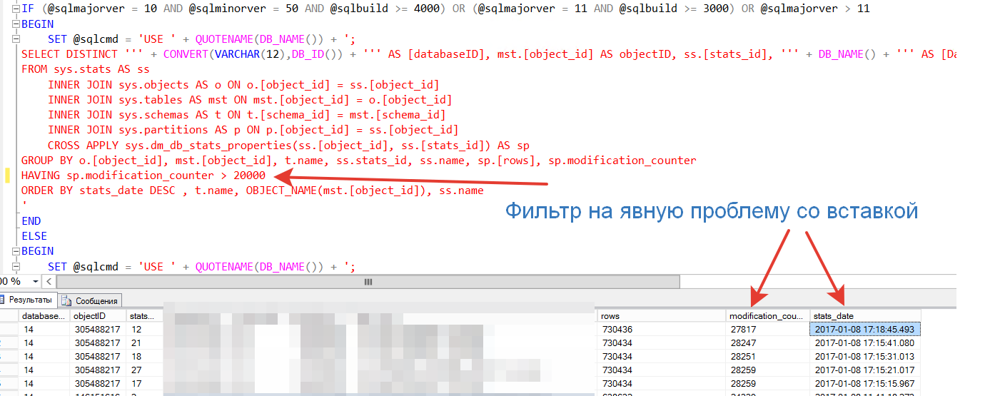
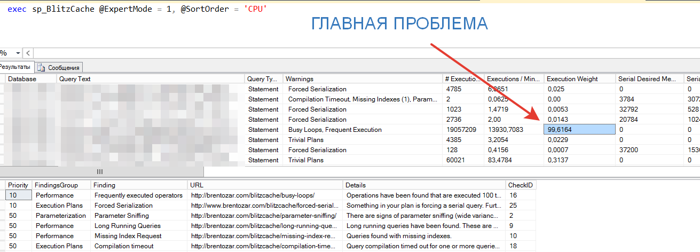

# Всем нужен эксперт

**Приходя на проекты, где необходимы серьезные архитектурные решения, в прошлом году я столкнулся… Скажем, так - с завышенными ожиданиями от компетенций. То есть если вкратце – некоторые вещи, которые для нас представляют собой «базовые», для наших партнеров и друзей оказывались «открытием Америки». Почему так складывается? Лично моё предположение, что за счет огромного количества рутины – у большинства специалистов не хватает времени поднять голову и взглянуть на свою деятельность системно**

Одним из таких моментов – является процесс «владения СУБД для 1С. Данная статья преследует своей целью:

- Подготовить слушателей платного вебинара - https://infostart.ru/webinars/569490, на прошлом вебинаре по PostgreSQL подобный документ мы подготовили после вибинара, в этот раз хотим поступить по-другому. Базовая документация – раньше самого вебинара .
- Повысить уровень компетенции «группы владения» 1С+MSSQL
- Познакомить сообщество Infostart с коллекцией скриптов от PFE инженеров MS – на последней конференции Infostart Event в секции Highload почему то оказалось, что большинство экспертов 1С почему-то даже не слышали про эти скрипты
Структура статьи будет иметь цветовую дифференциацию порядка работ.

**Итак, начнем - предположим у Вас есть сервер MSSQL на котором у Вас размещена база 1С. Соответственно вы обязаны выполнить 4 последовательных этапа**

- <span style="color:#B22222; font-weight: bold;">Бордовый</span> – настройка «инстанса» SQL сервера
- <span style="color:#FF0000; font-weight: bold;">Красный</span> – ежедневный мониторинг и исправление
- <span style="color:#FFD700; font-weight: bold;">Желтый</span> – еженедельный анализ и рефакторинг
- <span style="color:#008000; font-weight: bold;">Зеленый</span> – исследование и развитие контура

Я преполагаю что: 

- вы знакомы с настольной книгой эксперта 1С https://1c.ru/news/info.jsp?id=17973
- вы умееете нажимать кнопку "Скачать на Github"
- вы умеете немного читать код SQL

## Бордовые дни

Все что написано ниже – воспринимайте как чеклист. То есть правило следующее – сделать надо обязательно, если не доказано обратное. То есть это не рекомендация, которой можно следовать, а можно не следовать. Это прямые указания, отказаться от которых можно только в особых случаях

Что | Как | Объяснение
---|---|---
Лимитирование лога ошибок | Запись в реестре NumErrorLogs | Предназначено для сокращения количества файлов «лога ошибок», чтобы исключить в продуктиве ошибки типа **SQL Error Log Handle To Big**
Ограничение административных подключений только одним соединением | Вызов хранимой процедуры с установкой параметра remote admin connections = 1 | Убираем вероятность администрирования несколькими экспертами одного сервера, что чаще всего приводит к разрушению баз данных
Включение сжатия по умолчанию для архивных копий если сервер не лимитирован по CPU | Установка параметра backup compression default = 1, если версия MSSQL сервера не оптимизирована под лимитацию CPU | Для версий старше 10-той, то есть **SQL Server 2008 R2 – использование компрессии для архивный копий отличной от «по умолчанию» не рекомендуется. Попытка управлять этим значением может привести к артефактам в части блокировкам на уровне ресурсов CPU.**
Оптимизация под OLTP нагрузку | Установка параметра optimize for ad hoc workloads = 1 | Для OLTP и гибридных систем в которых идет постоянная вставка, этот параметр позволяет разделить построение планов запросов на 2 этапа – построение заглушки при первом вызове, и перекомпилирование реального плана при повторном вызове.
Отключение параметров автоматического сжатия, автоматического закрытия соединений и способа проверки страницы данных | Установка параметров <br> SET AUTO_CLOSE OFF WITH NO_WAIT <br> SET AUTO_SHRINK OFF WITH NO_WAIT <br> SET PAGE_VERIFY CHECKSUM WITH NO_WAIT | Чаще всего автоматическое сокращение базы и автоматическое закрытие соединений приводит к снижению производительности базы данных. Использование отличного от «CHECKSUM» способа проверки страниц, также ведет к снижению производительности. При наличии встроенных средств в 1С – другой вариант проверки считается избыточным
Автоматическое создание и обновление статистики | Установка параметров <br> SET AUTO_CREATE_STATISTICS ON <br> SET AUTO_UPDATE_STATISTICS ON | В 2016 году признано всеми вендорами включая SAP – что ни одна из попыток ручного управления «статистикой» для оптимизации поиска не дала результатов. Поэтому по умолчанию всегда включаем ее автоматическое обновление. В купе с параметром оптимизации под OLTP нагрузку приводит к отсутствию артефактов связанным с избыточным чтением, при неправильно построенных запросах.
Использование параллелизма | Установка <br> max degree of parallelism = 1 | Самый холиварный параметр. Для 1С устанавливаем в «единицу», включение распараллеливания запросов возможно только если доказано наличие оптимального кода для управления блокировками и согласно мониторингу не было обнаружено «дедлоков».
Использование памяти | Установка параметра <br> max server memory (MB) | Используем этот скрипт – если коротко: максимальная память зависит от архитектуры процессоров, их количества, от количества рабочих процессов

Ссылка на SQL скрипт:
- https://github.com/Microsoft/tigertoolbox/blob/master/MaintenanceSolution/0_database_server_options
- Для удобства определения своей версии SQL сервера используйте эту табличку https://sqlserverbuilds.blogspot.ru/ 

Дополнительно – для перехода к ежедневному наблюдению за СУБД необходимо:

Что сделать | Скрипт настройки
---|---
Настроить агента рассылки, чтобы получать письма напрямую с SQL сервера, не дожидаясь оповещения с систем мониторинга | Используем Вот этот SQL скрипт <br> Заполняем параметры <br> <ul><li>Доступа к SMTP</li><li>Параметры единого ящика DBA администраторов (например у нас это группа рассылки dba.admins@silverbulleters.org с доступом на отправку только через SQL сервер.</li></ul>
Настроить специфичные ошибки SQL которые требуют немедленного реагирования | Используем Вот этот скрипт <br> Ошибки SQL сервера будут считаться со степенью важности – 10, то есть почти максимальные.

## Красная зона

Итак – вы настроили сервер СУБД и запустили в него пользователей. Чтобы перейти к сложным тюнингам, и сложным исследованиям – вам необходимо купировать массовые проблемы. Причем крайне желательно делать это максимально автоматизировано, чтобы больше никогда в «красную зону не возвращаться»

Обязательная скорость реакции DBA в течении 5 минут на следующие типы ошибок

@import "all-you-need-is-expert_files/table_1.csv"

Итак, если на Вашу почту не приходит оповещение об ошибках, указанных выше, теперь можно переходить к ежедневной проверке и контролю красных проблем.

Вообще в мире MSQL принято каждое событие нормировать параметром Severity (Серьезность)

Красная зона – **это серьезность от 0 до 50 включительно**
Желтая зона – **это от 51 до 150 включительно**
Зеленая зона – **от 150 и до 999.**

Указанные выше ошибки считаются самыми серьёзными, однако – PFE инженеры и мы, подключаем еще одну группу ошибок к рассылке SQL агентом

@import "all-you-need-is-expert_files/table_2.csv"

Описание ошибок – доступны в интернете, в том числе и на русском. Но чтобы вы могли искать описание этих ошибок автоматически, помимо автоматического скрипта создания рассылки email, нам понадобится автоматический определитель проблем, который покажет ссылки на описание ошибки и способа ее устранения. - скрипт берется отсюда

```
exec sp_Blitz @IgnorePrioritiesAbove = 50 
```

Вообще вам будет удобно понять параметры данный хранимой процедуры

@import "all-you-need-is-expert_files/table_3.csv"

Остальные параметры описаны тут и необходимы уже чаще всего в сложных анализах
Кстати – Как вы думаете сколько tempdb должно быть по умолчанию?.
А вы знаете что если ответить «одна», то это считается проблемой ;-).

## Желтая зона

Итак – если вы уже НЕ получаете оповещений о проблемах серьезности выше чем 50. Кстати внимательный пользователь – запустивший у себя скрипты уже, наверное, знает, что проблемы отсутствующих индексов – это проблемы уровня 50. То есть если вы настроили правильно рассылку, то уже увидели то что у вас на продуктивной базе 1С их около 300 ;-). Это кстати классическое среднее число на активной базу 1С. Надеюсь вы уже воспользовались обработкой https://infostart.ru/public/439778/ для определения где и почему у вас отсутствующие индексы.

А мы вернемся к желтой зоне, она состоит из 5 этапов которые необходимо выполнить

Этап | Способ осуществления
---|---
Оценка состояния индексов | `USE <вашаБаза> exec sp_BlitzIndex @Mode = 4` 
Оценка состояния статистики | `exec view_Stats_Last_Update.sql`
Выявление главной проблемы по CPU | `exec sp_BlitzCache @ExpertMode = 1, @SortOrder = 'CPU'`
Выявление главное проблемы по RAM | `exec sp_BlitzCache @ExpertMode = 1, @SortOrder = 'memory grant'`
Выявление главной проблемы по чтению | `exec sp_BlitzCache @ExpertMode = 1, @SortOrder = 'reads'`
Выявление главной проблемы по записи | `exec sp_BlitzCache @ExpertMode = 1, @SortOrder = 'writes'`

Вам понадобится следующий комплект скриптов:

- **Индексы** - https://github.com/BrentOzarULTD/SQL-Server-First-Responder-Kit/blob/dev/sp_BlitzIndex.sql
- **Работа с «кэшем»** - https://github.com/BrentOzarULTD/SQL-Server-First-Responder-Kit/blob/dev/sp_BlitzCache.sql
- **Статистика** - https://github.com/Microsoft/tigertoolbox/blob/master/Statistics/view_Stats_Last_Update.sql

Методика выявления желтых проблем следующая:

### Статистика

- Вначале делаем так чтобы статистика была актуальной и объем измененных записей не превышал 20000 между обновлением статистики и текущим значением модификации.
- Откуда взялось значение 20000? Эмпирическое число от Microsoft для систем типа 1С, SAP, Dynamics
- Для версий MSSQL младше не забываем включить флаги трассировки
  - 1118 
  - 1117
  - 2371
  - 4199
  - 8048

Визуально это выглядит так:


То есть если у вас есть таблицы с объемом модификаций выше 20.000 где статистика не обновлялась автоматически – эти таблицы добавляются в принудительное обновление статистики чаще чем раз в день. Планы обслуживания СУБД – тема отдельной статьи, однако для базовых вещей достаточно этой статьи на ИТС

 - http://its.1c.ru/db/metod8dev#content:src/developers/scalability/instructions/i8105837.html

**Индексы – проблемы от 51 до 150 считаются желтыми».**

Классические проблемы индексов:
- Дубликаты индексов (Multiple Index Personalities: Borderline duplicate keys)
  - Отображение – много записей, мало чтений
  - Например - Reads: 6 (6 seek) Writes:142,319
  - Способ исправления – сравнить индексы на таблице с помощью
    - `EXEC dbo.sp_BlitzIndex @DatabaseName='yourdb', @SchemaName='dbo', @TableName='_TableName';`
    - Найти дубликат индекса
    - Зайти в метаданные и оставьте только один индекс. Как это сделать – изучите настольную книжку 1С:Эксперт.
- Слишком много индексов (Index Hoarder: Many NC indexes on a single table)
  - Отображение – много записей, мало чтений
  - Например - **25,534 reads (ALL); 1,551,717 writes (ALL);**
  - Способ исправление
    - `EXEC dbo.sp_BlitzIndex @DatabaseName='yourdb', @SchemaName='dbo', @TableName='_TableName';`
    - Сравнить все столбцы поиска
      - Исправлять только когда удалены дубликаты
      - Оптимизировать состав индексов
      - Зайти в метаданные – поставить нормальные индексные выражения
      - Зайти в код – найти выражения поиска по таблице в запросах, проверить что выражения поиска используют новый индекс
      - Отрефакторить код
      - После рефакторинга убедиться, что не появилось «отсутствующих индексов»
- Неиспользуемые индексы (Index Hoarder: Unused NC index)
  - Отображение – нет чтений совсем, нет записи
  - Например -  Reads: 0 Writes: 0
  - Способ исправления
    - Зайти в метаданные
    - Убрать индексацию
    - Исправлять только когда нет отсутствующих и дубликатов

Есть еще несколько классических проблем – но в целом подход к исправлению один и тот же.

### Проблемы кэша

Последнее, но самое сложно по пониманию – это «желтые» проблемы работы с ресурсами. Вы должны понять следующее:

**«Ни один запрос к СУБД не должен превышать 25% от общей нагрузки на ресурс инфраструктуры»**

Поэтому выполните следующие команды в консоле SQL:
```
exec sp_BlitzCache @ExpertMode = 1, @SortOrder = 'CPU'
exec sp_BlitzCache @ExpertMode = 1, @SortOrder = 'memory grant'
exec sp_BlitzCache @ExpertMode = 1, @SortOrder = 'reads'
exec sp_BlitzCache @ExpertMode = 1, @SortOrder = 'writes'
```

Найдите запрос который выполняет максимальную нагрузку по указанному ресурсу:


В колонке «План запроса» вы увидите главного «нагибателя» Вашей СУБД. Используя Инструменты разработчика - //infostart.ru/public/15126/ вы быстро найдете примерный код в 1С который является проблемой. Рефакторинг 1С решений – это также тема отдельной статьи, но как показывает наша практика на 2016 год основными проблемами являются

- Неумением писать запросы на языке 1С с применением ключевого слова СОЕДИНЕНИЕ
  - Большинство разработчиков не понимают, что соединять нужно таблицы в порядке увеличения записей – то есть вначале с меньшим количество, а уже к ней с большим.
- НЕ индексирование временных таблиц
 - Временная таблица должна индексировать всегда, если не доказано обратное, а не наоборот. Поля индексации временной таблицы выбираются так, чтобы СОЕДИНЕНИЕ строилось только по индексированным полям
- Работа «с двумя точками»
  - Выборка данных НИКОГДА не должна делаться через 2 точки, а явно подразумевает необходимые внутренние соединения внутри запроса.
- Незнание поведения конструкции В(&СписокИлиТаблица)
  - При использовании конструкции .УложитьСписокОбъектов(КакойТоСписок) если значений больше чем 128 – то на SQL это будет выглядитель как созданием временной таблицы, а не как конструкция IN(Params)
- Неверное использование конструкции ПОДОБНО
  - В запросе использование конструкции ПОДОБНО «%ЧтоТо%» еще со времен FoxPro вызывает полное сканирование всей таблицы и не индексируется почти никогда.  Для проверки на вхождение в строку её части в любом месте – должен применятся специализированный алгоритм «Полнотекстовый поиск», либо внутренний в 1С, либо внешний с помощью например ElasticSearch

Обычно, в 95% случае оценка кэша – выдает именно эти проблемы в запросах 1С. Ну и конечно массовая, не гранулярная вставка значений в регистры.

## После красно-желтых дней
Если подытожить, то порядок работы следующий

- Настроить сервер
  - Память, SMTP и параллелизм
- Включить Email рассылку для ключевых проблем
  - Подключить 2 SQL скрипта Microsoft и BrentOzar
  - Купировать проблемы от «нуля» до «50»
- Оценить
  - Отсутствующие индексы
  - Затратные индексы
  - Неиспользуемые индексы
  - Деградацию статистики
- Зафиксировать наиболее проблемные
  - Запросы по CPU
  - Запросы по RAM
  - Запросы по READS
  - Запросы по WRITES
- Сформировать план по рефакторингу кода и метаданных
  - Включить в работы по проекту план по оптимизации исходя из следующего правила
      - Одна проблема «желтой» зоны за 2 недели должна быть исправлена

## В качестве заключения небольшой FAQ
- Есть ли какие-нибудь другие скрипты у PFE инженеров?  
  - Да конечно. Тысячи их.
- Как всегда быть в курсе, что новенького у PFE инженеров?
  - Обычно делается так: создается email sqlexpert@example.com и на него делается регистрация списка рассылки. Если знаешь английский – то используется способ подачи Issue через репозитории GitHub.
- Можно ли исправлять красные и желтые проблемы только на уровне MSSQL ?
  - НЕТ. Если в Вашем продуктиве есть такие проблемы, то 99% случаев – это проблемы некачественного кода в вашей конфигурации или в Ваших доработках типовой.
- А где же ЦУП и остальное?
  - По нашему скромному мнению – внедрять ЦУП или другие средства, специализированные для 1С, стоит только после применения инструментов MSSQL для купирования первичных классических проблем. А уже потом заниматься тонким тюнингом.
- Можно ли создавать индексы средствами СУБД?
  - На сегодняшний день рекомендации компании Microsoft следующие – для купирования проблем: да можно, но, если индексы созданы на уровне СУБД – обязательна фаза рефакторинга кода приложения. В нашем случае (применительно к 1С) – создание индексов средствами СУБД является нарушением лицензионного соглашения и фактически снимает Вас с поддержки. Поэтому если объединить обе рекомендации – то получается. Создавать индексы средствами СУБД можно только в одном случае, если вы обязуетесь после этого исправить код приложения – точнее 1С конфигурации. Если вы этого не сделаете – Вы подставились. Если бизнес не готов согласовывать доработку и рефакторинг – с таким бизнесом лучше работать «жестоко» и напрямую указывать, что их действия по несогласованию рефакторинг ведут к непредсказуемым последствиям в части потери данных или выхода из строя всего контура.
- Вы с чем то в статье не согласны?
  - Предполагаю что к подобной статье будет множество комментариев формата "Я не согласен", поэтому заранее прошу всех не согласных не рефлексировать, а писать свои статьи, в которых отражать свой подход к владению конутром 1С+MSSQL
- А как же сервисы Гилева ?
  - Я думаю Вячеслав с командой давно изучил указанные скрипты и имплементировал в своих сервисах наиболее интересные решения. За что ему наш почет и уважение. Нам же просто удобней использовать именно эти скрипты на процессах аудита - так как компания BrentOzar специализируется именно на MSSQL решениях https://www.brentozar.com/