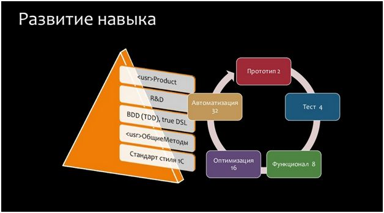
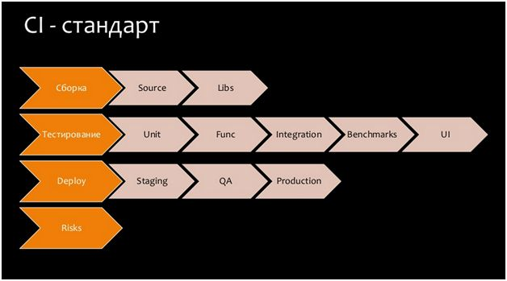
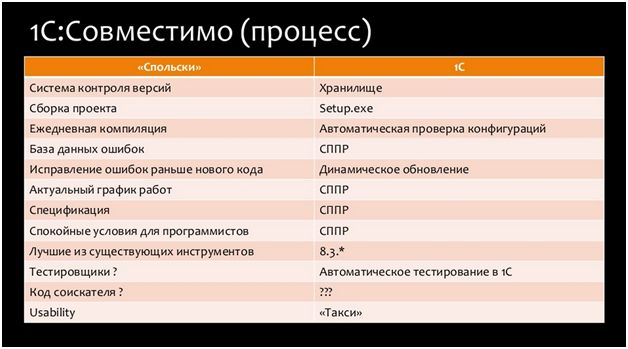
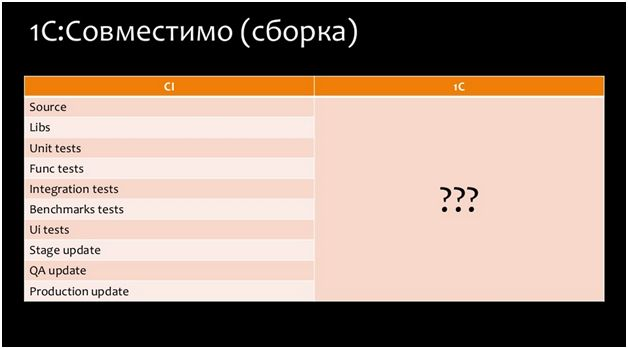
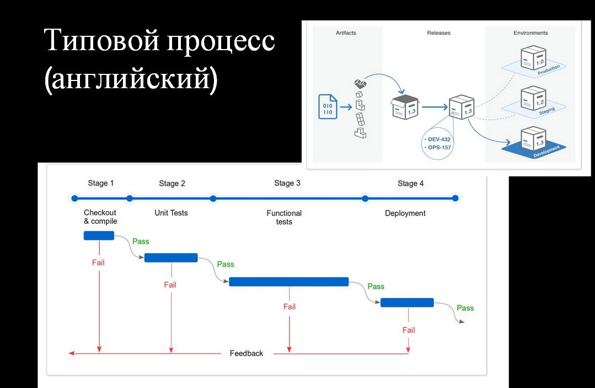
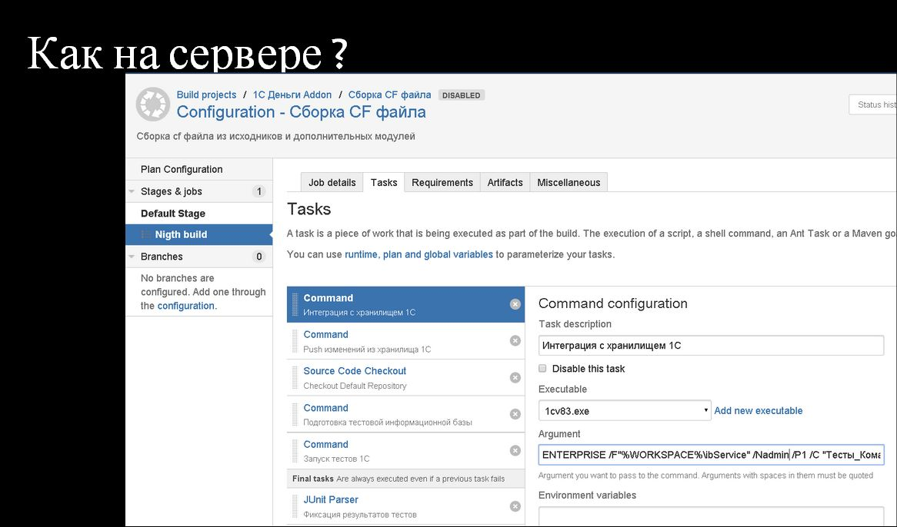
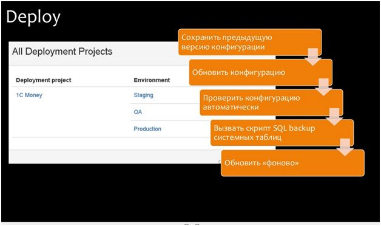
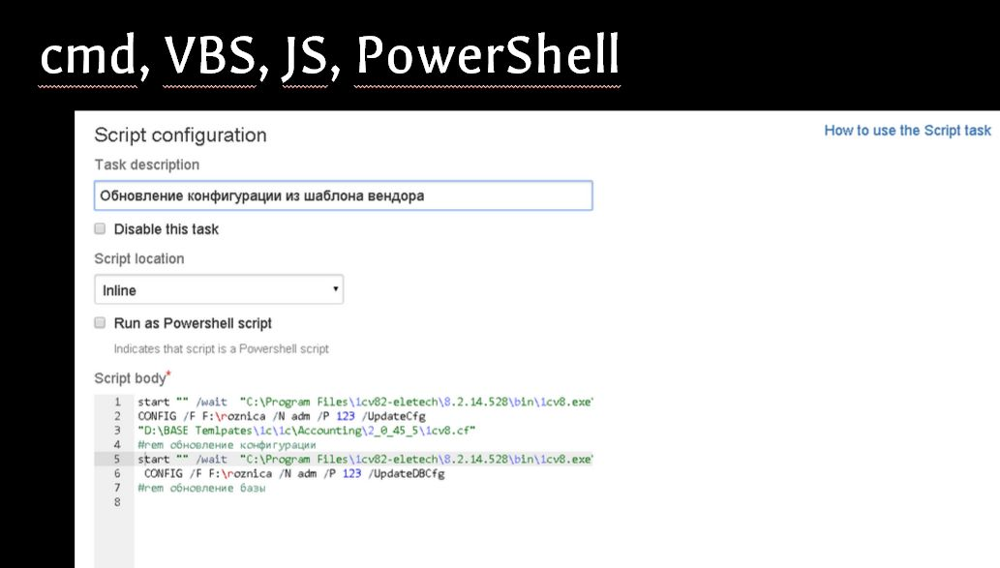
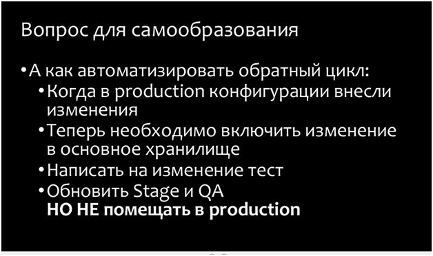

# Автоматическая сборка и развертывание на платформе 1С

**Данная статья написана по материалам доклада, прочитанного автором на Конференции Инфостарта IE 2014 29-31 октября 2014 года. Речь пойдет о стратегии**

## Развитие навыка разработчика

Кто-нибудь занимается автоматизацией самого себя? Оказывается, **когда вы начинаете себя автоматизировать, вы растете в профессиональном плане**, становитесь крутыми разработчиками. Выглядит все это примерно так, как на пирамиде слева (она олицетворяет собой пять основных навыков настоящего разработчика). Обратите внимание - на самой вершине пирамиды находится навык самого высокого уровня: когда один продукт полностью обслуживает один разработчик. Казалось бы, при чем здесь автоматическая сборка и развертывание? А при том, что **разработчик – один, а все остальное делается автоматически**.

Как вообще выглядит этот процесс?

- Вначале вы строите прототип на 1С,
- Потом пишете тест,
- реализуете функционал,
- производите оптимизацию,
- а уже в конце автоматизируете работу со своим продуктом.

Получается, что автоматизировать себя вы начнете только тогда, когда вырастете как специалист до пятого уровня.

## Стандарт автоматизации - Continuous Integration

Давайте попробуем представить себе, что все мы – специалисты пятого уровня. Чтобы что-то автоматизировать, нужно что-то понять. Соответственно, для тех разработчиков, которые хотят себя автоматизировать, во всем мире есть стандарт CI (ContinuousIntegration) – постоянная интеграция кода в Production. Он выглядит примерно так, как на рисунке.

Целью непрерывной интеграции является **сборка. Сборка состоит из исходников и библиотек.**

- Дальше идет **тестирование**. Тестирование бывает пяти видов:
  - Юнит-тестирование;
  - Функциональное тестирование;
  - Интеграционное тестирование;
  - Benchmarks;
  - И тесты User Interface.
- Также очень важным процессом является **Deploy (развертывание)**.
- А чтобы все это стабильно работало, нельзя забывать про **Risks (снижение рисков)**.

## Снижение рисков. Тест Спольски

Давайте более подробно поговорим про риски. На слайде показан типовой процесс разработки уровня 1С:Совместимо. Если вы хотите что-то автоматически развертывать и собирать, типовой процесс работы с 1С у вас должен выглядеть примерно так, как это показано здесь.

Обратите внимание на то, что написано **в заголовке левого столбца**. Это – **12 вопросов теста Спольски на качество разработки**. На эти вопросы можно ответить «да» или «нет». Согласно этому тесту:

- Если у вас будет 12 «да», то вы отличный разработчик.
- Если у вас будет 11 «да» и один «нет», то вы не очень хороший разработчик,
- А если 10 и меньше – вы ведете разработку совсем неправильно.

Да, так говорит Спольски – он умный, он в Microsoft работал.

Напомню, мы сейчас обсуждаем развитие навыков разработчика до пятого уровня, соответственно, **чтобы делать качественные продукты, мы должны стараться разрабатывать их в соответствии со стандартами**, даже если вы – один фиксированный программист. Согласно тесту Спольски, вы хорошие разработчики, если:

- У вас есть **хранилище**;
- Если даже внутри компании вы делаете **сборку проекта**. В 1С-мире под сборкой проекта подразумевается файл поставки, setup.exe.
- Еще Спольски говорит, что нужна **ежедневная компиляция**. Что такое компиляция для продуктов 1С, как вы думаете? Компилятор на 1С – это галочка внутри конфигуратора **«Полная синтаксическая проверка конфигурации»**. Напомню, мы это все должны автоматизировать, и я настоятельно рекомендую вам это сделать через OneScript.
- База данных ошибок – это СППР.
- Актуальный график работ – это СППР;
- Наличие спецификаций – это СППР;
- И **спокойные условия для программистов** – в мире 1С для всего этого тоже нужно использовать **СППР**. Почему именно СППР? Потому что если вы хотите правильно разрабатывать (в соответствии со стандартами), вам нужно думать. А СППР дает вам возможность не сразу писать код, а сначала подумать. Со всеми вытекающими плюсами и минусами.
- По поводу **исправления ошибок раньше нового кода**. Это – концепт хотфиксов, он должен быть у вас по стандарту. Когда вы напрямую в Production исправляете ошибки – это называется хотфиксы, исправление публикуется раньше, чем новый функционал. В 1С это реализуется с **помощью динамического обновления конфигурации**.
- Что касаетсякода соискателя, то тут у меня вопрос. Согласно Спольски, нормальная продуктовая разработка – это когда соискатели при приеме на работу пишут код. У вас соискатели пишут код? А как быть в случае, когда я один – разработчик продукта, я что, должен сам себе на соискание код писать? Но если у вас этого нет, то вы рискуете.

Риски здесь (на картинке) показаны справа. Если у нас этого нет, то значит, у вас риски.

## Сборка. Состав

Как вы думаете, из чего должна состоять сборка, из чего должен состоять setup.exe? Напомню, что согласно CI-стандарту сборка является набором исходников и библиотек.

А что такое, по-вашему, исходники на 1С? Конфигурации, внешние обработки, внешние отчеты, тесты, автоматизированные скрипты? Если вы хотите разрабатывать по-промышленному, подумайте, что это для вас? В стандарте написано, что **сборка должна состоять из исходников, но что из перечисленного вы для себя выберете – это только ваше дело.**

## Организация процесса сборки и развертывания.
### Работа с сервером сборок

Как выглядит типовой процесс сборки и развертывания? Примерно вот так (этот скриншот из документации к серверу сборок Bamboo). Это – типовой процесс, который можно внедрить и при работе в 1С. Вы можете работать по этому стандарту, при этом неважно, кто вы – большой Enterprise или программист-одиночка.

**Сервер управления сборками – это сервер управления задачами**. Все есть задача. Для того, чтобы что-то автоматизировать, нужно научиться разделять различные концепции на задачи.

Типовая сборка выглядит как набор задач (показано на слайде):
- Интеграция с хранилищем 1С
- Push изменений из хранилища 1С
- Подготовка тестовой информационной базы
- Запуск тестов 1С
- И т.д.

**Все делается автоматически**. Из хранилища выгружается cf, загружается в тестовую базу и там прогоняются тесты.

Теперь давайте отдельно рассмотрим **процесс развертыванияв Production**:

- Во-первых, поскольку мы работаем 24/7, **нужно обновлять фоново**. Но это функционал уровня КОРП. Но даже если у вас сервер не уровня КОРП, это можно реализовать средствамиSQL – таблички в SQL ведь копируются.
- Но только перед тем, как что-то обновить, **нужно сделать бэкап**. Причем, когда вы будете писать скрипт для бэкапа, подумайте – нужно ли автоматизировать бэкап базы полностью? Я считаю, что нет. А знаете, почему? Потому что при обновлении метаданных вас интересуют только сервисные таблички, все остальное платформа 1С сделает за вас – копии табличек не просто так делаются.
У кого есть проблемы с обновлением базы? Так вот, с бэкапом получается по-другому: **мы можем бэкапить только системные таблицы и их восстанавливать.** Я сейчас говорю не про код, я говорю про обновление структуры данных.
- Что значит **«Проверить конфигурацию автоматически»** перед тем, как помещать ее в продакшн? Есть **галочка «Полная проверка конфигурации», все работает автоматически**

Обратите внимание, это – скрипт на PowerShell. Так **настоящие программисты автоматизируют собственную деятельность.** Если PowerShell вам в голову не ложится, пишите скрипты на OneScript – так будет проще.

**С помощью скриптов** можно делать автоматическую компиляцию (автоматическую проверку синтаксического контроля), можно делать файл поставки и т.д. Если это автоматически – то почему бы это не запустить? Если вы точно знаете, что это сокращает деньги.

Говоря «синтаксический контроль» я имею в виду не проверку модуля, а эту галочку «Полная проверка конфигурации». Вы запускаете этот процесс каждую ночь и наутро знаете, насколько стабильна у вас конфигурация. Полная проверка конфигурации делается раз в день, автоматически, даже если релиз компании у вас раз в две недели.

## Понятие релиза
Давайте разберемся, что же такое релиз? Это глагол или существительное? Это процесс или это артефакт? Это бумажка, где описан процесс, сопутствующий изменению версии конфигурации, или это файл setup.exe?

С одной стороны, релиз – это сборка, поставка, это файл setup.exe.
А с другой стороны, это такая бумажка – регламент по обновлению,чек-лист, события из которого нужно выполнить.
Если вы посмотрите, то в английском языке release – это одновременно и существительное, и глагол. Поэтому **релиз – одновременно и некий файл, и процесс по его деплою.** А процесс можно автоматизировать, чтобы не тратить деньги.

## Заключение

Пока вы смотрите на вопросы для самообразования, попробуем поиграть…

Сколько стоит ручная рутинная работа программиста? Если он час в день тратит на рутинные задачи и это делается год… По московским ценам умножаем на заработок программиста – там миллионы рублей получаются. Поэтому надо стремиться автоматизировать свою деятельность.

**Если разработчики автоматизированы скриптами**, они становятся круче. Они, автоматизируя себя, начинают заниматься более интересными сложными делами. Сразу выясняется, что **они могут не только рутиной заниматься, а еще и пользу приносить.** К тому же это все в деньги упирается – **работать становится прибыльнее.**

Ключевой вопрос – зачем себя автоматизировать? В жизни столько интересного, чтобы тратить время на рутину. Я в этом убежден.

Для сокращения затрат нужно внедрять серверы сборок. **Если вы собираетесь разрабатывать по-промышленному**, если вы хотите узнать, как правильно, **то правильно – это автоматически, с помощью скриптов, на сервере сборок.** Нужно просто пойти прямо сейчас и сделать это.

Вам нужно забыть, что вы 1С-программисты. Если вам интересно, где уже работает автоматическая сборка, развертывание, то **это работает везде. Скрипт – это всего лишь способ автоматизации собственной деятельности.**
