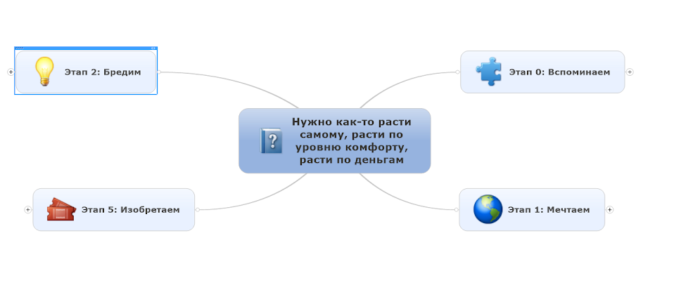

# Решатель карьерного роста программиста маленького городка

**В чем же проблема карьерного роста - как заработать не уезжая, или наоборот уехать. Как повысить свой уровень как программиста. Самое главное - описать проблему, вот этим мы и занялись. А что из этого получилось просим просмотреть сообщество.**

У меня тут был опробирован алгоритм принятия архитектурных решений, к не предназначенной, казалось бы для этого задаче как решить проблему **"Нужно как-то расти самому, расти по уровню комфорту, расти по деньгам"**

Фазы пройденные по алгоритму решения:

Более подробно на видео, как это все получилось:

**Часть 1:**

*Видео в источнике не было*

**Часть 2:**

**Список пересечений действий:**

<!-- @import "career-solver_files/desigion_matrix.csv" -->

Шаги к выполнению:

- создать каталог своих наработок
- создать список абстрагированных или декомпозированных текущих задач
- создать список интересных разработок чужих
- просмотреть интересных фрилансеров
- перечитать все методики
- проанализировать свою компанию
- найти кого-нибудь кто тоже открывает компанию
- найти удаленную работу

и в Google Docs документах:

1. тезисы screencast'а
1. итоговая карта памяти
1. пересечение действий 

*в источнике ссылки через редиректы infostart, нужно восстановить*