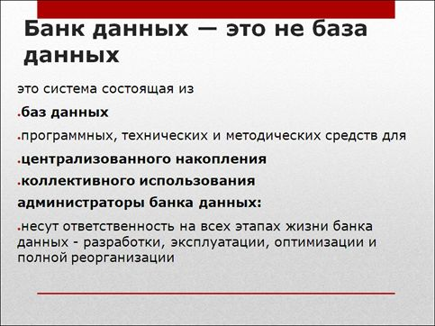
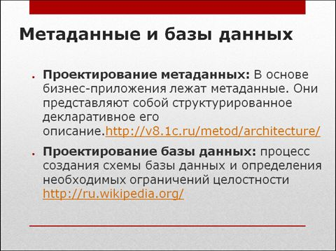
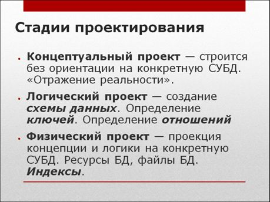
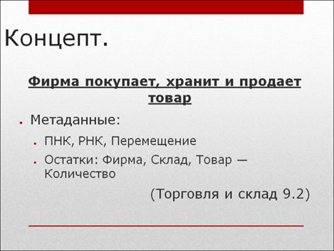
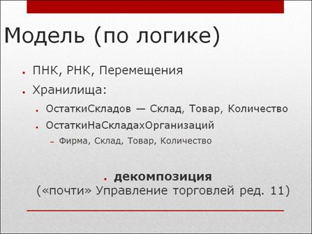
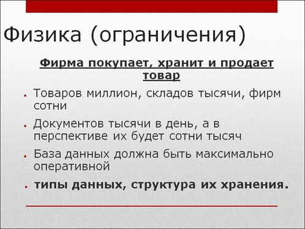
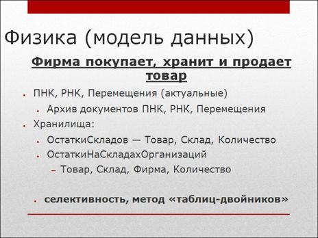
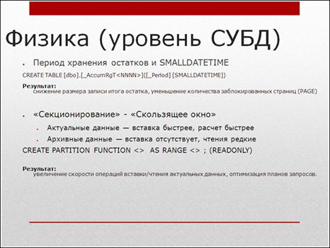

# Уровни абстракции: Корреляции проектирования метаданных и проектирования СУБД. Тонкости механизмов СУБД на высоконагруженных системах на примере MSSQL

Данная статья написана по материалам доклада, прочитанного автором на первой конференции инфостарта 2012 года. Она опубликована в журнале Инфостарта №1. Речь в статье пойдет об уровнях абстракции, о том, что необходимо для того, чтобы исключить проблемы, связанные с утечкой абстракций. Также будут рассмотрены вопросы наличия у программистов 1С системного мышления, поиска причинно-следственных связей и умения принимать обоснованные решения в сложных условиях. Это самые главные качества, необходимые программисту.

Я бы хотел обратить ваше внимание на то, что обычный мир развивался достаточно веселым способом:

- В 80-е года были мейнфреймы (огромные базы данных с тонкими клиентами – правда эти клиенты были текстовые и  telnet-ные)
- Затем была эра клиппера – различных DOS-овских баз данных, в основном, однопользовательских
- Затем наступила эра клиент-серверных СУБД, баз данных, банков данных
- И только затем (на данный момент) мы имеем некие распределенные, облачно-туманные банки данных (базы данных, приложения и т.д.). Если кто не в курсе, «туман» - это некий такой мейнстрим – когда вам нужно выполнить миллиард транзакций параллельно. Где вы найдете миллиард серверов? А миллиард мобильных устройств вы найдете легко. Соответственно, необходима только платформа, которая выполнит параллельно эти транзакции на мобильных устройствах и потом совместит их в облаке и потом уже итоговый результат агрегирует.

Где же находимся мы в нашем мире 1С?

- Пользовательскую часть мы прошли, когда у нас фактически была однопользовательская СУБД
- Полноценная двухзвенная (клиент-серверная) архитектура у нас продлилась до 2008 года
- На данный момент мы находимся в трехзвенной архитектуре, и для нас действуют именно те законы, которые для остальных приложений действовали 10 лет назад.

Маркетинговая фишка насчет облака, как я считаю, еще пока что не совсем у нас, она все-таки в несколько других фреймворках и приложениях.

Поэтому – я хотел бы обратить ваше внимание на то, что банк данных – это не совсем база данных

Привожу цитату из Википедии или из методички института по проектированию баз данных:

Короче: **банк данных – это все, что мы разрабатываем.**

У нас есть приложение, которое ведет учет в компании. Фактически это ваш банк данных. А вы его администратор.

А теперь вернемся к самому главному – от теории ближе к практике.

Дело в том, что, **согласно методике 1С, проектирование метаданных - это проектирование бизнес-приложений**. Ориентир на то, чтобы удовлетворить потребности бизнеса. **И это работает, когда мы хотим удовлетворить потребности бизнеса на первом этапе.**

А когда мы говорим о проектировании СУБД, то мы говорим о том, что это процесс создания схемы базы данных и определения необходимых ограничений целостности. То есть, совершенно другое определение, чем нам говорит определение компании 1С.

На самом деле, верно и то и другое определение. Почему?

Потому что **1С вам говорит о том, что вы должны спроектировать концептуальный проект. Когда метаданные строятся без ориентации на конкретную СУБД и отражают реальность, происходящую в компании** (в Вашей компании, компании клиента, компании заказчика).

А если вы копнете чуть поглубже, в методику, которая положена для разработки приложений, занимающихся учетом, то там, оказывается, еще есть две стадии – если вспоминать уровни абстракции, то **следующий уровень абстракции – это логический проект (когда мы должны определить схему данных, определить ключи и определить отношения между сущностями)**, и тут мы начинаем говорить уже не о бизнес-моделях, а о каких-то новых для нас понятиях (хотя многие об этом забывают). Однако физически мы все-таки это делаем – когда вы создаете новые объекты метаданных, вы фактически строите схему данных, строите отношения и создаете ключи.

Но самое ужасное – есть еще один уровень абстракции, который находится еще ниже. **Для логического проекта вы должны построить физический проект – это когда вы должны спроектировать, как данные будут лежать на файловых системах**, и тут, в любом случае, вам будет необходимо знать, каким образом вы будете складывать данные на аппаратную составляющую.

С учетом развития SAAS решений, может быть, от вас это будет скрыто, но, как мы помним, все протечет рано или поздно, и какой-нибудь администратор супер-облака со SLA 24/7, все равно промахает делание бэкапов и вам все равно придется к этому вернуться (как показывает практика). И вам нужно будет знать, а делались ли бэкапы, а как там оно лежит, и вдруг выяснится, что этот файл вообще лежит где-нибудь на амазоновском сервере в Ирландии, и этот сервер два дня назад рухнул (условно).

Немножко практики:

Всех все устраивает. И тогда, 6 лет назад, всех все устраивало.

А кто давно в мире 1С, тот знает, что как только объем оборотов у компании увеличивался, как только она начинала торговать чем-то большим, данный концепт переставал работать.

Сейчас объясню, почему. Дело в том, что вам того не сказали, но, когда появилось УТ, а люди, которые проектировали УТ, они применили модель схемы данных уже «по логике».

А по логике получилось следующее, что метаданные, осуществляющие движение бизнес-объектов остаются, а вот хранилища разделяются.

Дело в том, что **здесь был применен способ «декомпозиции»**. Наш ключ был слишком длинный (суперключ, если мне не изменяет память). И поэтому были разделены две сущности – регистр, который однозначно отвечает на вопрос, на каком складе лежит товар, и – вторая сущность – чей товар на каком складе лежит.

По-моему, декомпозицию проходят на 2-м курсе МГТУ им. Баумана. И там учат, к чему применение декомпозиции приводит. По большому счету, вы **распараллеливаете потоки. Сущность становится проще. Одна отвечает на свой вопрос. Другая отвечает на свой вопрос.**

**Применив модель разделения по логике** (не делая суперогромный регистр, в котором лежит все и в котором хранится информация о том, чье это все – “Make World:SEL ECT * FROM *”), **вы грамотно решаете вопросы сразу двух категорий пользователей.** Одним пользователям нужно будет знать, где лежит товар (неважно, чей), а другим пользователям – бухгалтерам, нужно будет знать – чей, и совершенно неважно, где (на каком складе).

При распараллеливании потоков повышается производительность (отказоустойчивать) системы, улучшается многопользовательская работа. Всего лишь разделив два потока.

Это разделение модели (третий уровень абстракции).

Спускаемся на следующий уровень абстракции (на физический):

Вы начинаете задумываться о том, как сделать так, чтобы данные получались быстро, записывались быстро. И здесь вас не спасает уже ни логика, ни концептуальная модель.

Вы уже уходите от бизнеса в сторону физики. Как эти данные положить и как с ними удобнее работать. И что мы получаем?

Если говорить про модель данных с учетом концепта логики и физики, то мы уже здесь говорим, **что нам нужно**, скорее всего, **метаданные делить на актуальные и архив**. Допустим, вы выводим последний месяц (туда чаще писать и т.д.), а остальное – в архив.

Как реализовать консистентность системы, если у нее для каждой сущности будет применен архив - это вам домашнее задание.

**Скорее всего, вы здесь задумаетесь** о следующем – **о методе «таблиц-двойников»**. Как его поддержать – это отдельный разговор. Но этот метод на документации RSDN описан где-то в году 2003-м. То есть вам просто надо поискать в интернете, как хранить историческую информацию, если нужно иметь доступ и к актуальным таблицам, и к архиву.

Обратите внимание на параметр «селективность», который здесь написан.

**Остатки складов расставлены в порядке селективности измерений.** В семерке это делали очень многие – на «Торговле и Склад» меняли селективность на регистрах. Считали селективность поля и размещали эти поля в порядке селективности. **Дело в том, что SQL ведется хитрым образом – ему быстрее построить план запроса, если у вас впереди измерение с высокой селективностью.**

На самом деле, в последних релизах УТ11 уже применены знания о селективности, о методе таблиц-двойников и о декомпозиции. Кстати, декомпозиция - это пятая или шестая нормальная форма реляционной алгебры. Помнит про это кто-нибудь?

У вас система развивается – я напоминаю, вы в физику влезли, распределили уже все. И тут у вас средства 1С кончились. Так бывает иногда. В реальной жизни это неприменимо, это нарушает лицензионное соглашение. Но! Мы на сайте 1С++ проводили исследование – тип данных на таблице итогов регистра DATETIME – этот тип занимает 4 байта. Но нам же не нужно хранить итоги посекундно! Нам для хранения периода итогов вполне хватило бы месяца. Если бы мы могли поменять тип данных на таблице хранения итогов на SMALLDATETIME, который занимает 2 байта, то, согласно проведенному исследованию, MSSQL понижает уровень блокировки, и, как минимум в 2.5 раза повышается качество многопользовательского режима.

Это все к вопросу о проектировании метаданных. Нам нужно было понять, что период, если нам нужен месяц – тогда тип данных должен быть SMALLDATETIME – этого достаточно (единственное, что оправдывает 1С – это то, что этот тип достаточно новый – 2005 года).

А у нас ведь проблема все та же – количество пользователей растет. **Вам нужно повысить гранулярность транзакций.** Обратите внимание – про бизнес уже все забыли. Фирма все так же хранит и продает товар. Ничего не меняется. Растет только количество пользователей. Потому что бизнес развивается. Это важно. И если вы не будете поспевать за бизнесом в своем развитии – не будете расти как специалист, то бизнес потеряет деньги. А если он деньги потеряет – то вам никто не заплатит.

Завтра вам расскажут про секционирование, как его создать и зачем оно нужно. Можете поискать в Google по методу «Скользящего окна».

Дело в том, что система – например SQL (про Oracle не знаю) – позволяет делать секционирование по условию. **Вы делаете два быстрых винта – первый – SSD – очень-очень быстрый, второй – флешка. На флешке у вас лежат архивные данные, а на SSD-шнике максимально быстрые, которые вам нужны. И прямо применяете функцию на стороне SQL – порционирование по условию (реализуете метод «Скользящего окна»). Это та самая «денормализация» данных – физически данные у вас лежат на разных устройствах, а сущность метаданных у вас одна.** Бизнес ничего не будет знать о том, что у вас табличка с данными секционирована.

Обратите внимание, я там специально поставил READONLY, потому что сиквел при построении плана запроса по партиции с признаком READONLY ведет себя гораздо веселее… Потому что, если SQL знает, что по партиции не надо писать, он более правильным образом назначает блокировки.

Что мы получаем в итоге:

- Актуальные данные - вставка быстрее, расчет быстрее.
- Архивные данные - вставка отсутствует, чтения редкие

Результат:
Увеличение скорости операций вставки/чтения актуальных данных, оптимизация планов запросов

Бизнес работает быстрее, зарабатывает больше денег. Мне платят много денег – я счастлив.

Напоминаю, что за каждый ресурс надо платить (особенно применимо к облаку, где за каждое использование CPU вы платите деньги). «Make World SELECT * FR OM *» в облаке, конечно, заработает – но компания за это заплатит очень много.

Вы не просто занимаетесь оптимизацией ради оптимизации, вы всего лишь спроектировали одну бизнес-модель («Фирма покупает, продает и хранит товар»). Обратите теперь внимание, что, если теперь вернуться на слайд УТ – где там ошибка?

В УТ 11 **не построена модель «Сущность – связь».**

В методичке МГТУ им. Баумана написано, что для того, чтобы построить грамотную модель данных (физику, логику и концептуально), нужно построить диаграмму взаимодействий (модель «Сущность – связь»), определив, таким образом, что к чему относится.

Если вернуться к слайду УТ, то получается, фирма осуществляет покупку (то есть существует некоторая сущность, с помощью которой она осуществляет покупку – в нашем случае это документ Приходная накладная). Так же она хранит товар (сущность, отвечающая за хранение – это остатки). Продает (сущность, с помощью которой она осуществляет продажу – это Расходная накладная). Теперь поговорим о перемещении. У нас всего лишь один документ «Перемещение» - мгновенное перемещение с одного места на другое. В жизни-то все не так. Перемещение производится сутки, неделю, месяц… Я надеюсь, что в 12 версии УТ все-таки должна появиться некая сущность, которая будет называться «Акт о доставке». И тогда – по моему пониманию, полностью вся схема будет реализована. **То есть, сейчас, на мой взгляд – недопроектирована вся схема. Всего лишь – банально – забыли один документ.** А чем это грозит? **Вам придется повторно дорабатывать функционал.** А если вспомнить о процессе разработки – тестов-то у вас нет… Соответственно, вы доработаете, поломаете и – дальше понеслась…

В этом разница конференции «Инфостарта» от евангелистких семинаров неназванной конторы из двух букв. Здесь мы можем называть вещи своими именами. Методика 1С – это хорошо. Методика Java – да, какая разница? А методика .NET – а чем она отличается? А чем плоха методика проектирования СУБД Оракл? Методики все давно изобретены. Нам остается только делать выводы.

**Итак, выводы:**

- **Метаданные не для бизнеса, метаданные для базы данных. Для бизнеса – приложение** (желательно, стабильно работающее)
- **Если есть концепт, но нет логики и нет физического представления – нет работающей базы данных**
- **Неверный проект – впустую потраченные деньги** (потерянная репутация, программисты 1С – все але-гараж)

Обратите внимание, никто из выступающих сегодня докладчиков не ссылается на 1С, все читают свое. Все стараются вернуть доброе имя программистам. Мы – программисты (администраторы банка данных).

**Кто виноват?**

**Замена определений на собственные** – в 1С нет понятий ключей, сущностей, кортежей, множеств. Есть документ, остатки, справочник
**Абстрагирование от модели данных** – 1С это банк данных. А не платформа автоматизации предприятия. Мы должны нести ответственность за стабильную работу этого банка данных.

1С очень много сделали специально для нас. Просто сейчас новый виток развития. Мы вышли на средний уровень. Размеры баз данных исчисляются уже сотнями гигабайт (а сколько же в Камазе, а?) Но – когда мы начинали – входили в это, мы приняли на себя новые определения и забыли про базовые определения ключей, сущностей, кортежей, множеств… Забыли реляционную алгебру…

Реляционную алгебру я вспомнил и понял, что – кажется, зря я ее забыл… Надо к этому вернуться.

Все, что я вам сейчас сказал – это Google, MSDN, несколько книжек… Методичка МГТУ им. Баумана.

**Что делать?**

**Теория важна:** Кобб, Бойс. Реляционная алгебра, реляционные базы данных. Сущность – связь (один ко многим, многие ко многим)
**Проектируйте с нуля:** создавайте свою архитектуру – ER диаграммы, нормальные формы, суперключи, гранулярность операций. Вы вспомните сразу и про типы данных, и про селективность – потому что приложение без этого не взлетит. 1С скрыло от нас это четырьмя уровнями абстракций, которые протекли на данный момент.
**Devil in details** – тестируйте, исследуйте, проверяйте (регистры правил, таблицы-двойники, скользящее окно). Появилось что-то новое – изучайте. Кто попробовал 8.3? Надо, чтоб все… Регистры правил, например, кто знает, что такое? Это просто сложное условие -  детерминант, ключ… - нужно просто применить это все к миру 1С.

**Wish list**

- **Внешние ключи и ограничения на уровне СУБД – constrains & foreign key** есть во всех СУБД и они быстрее, чем на стороне сервера 1С (почему-то до сих пор 1С выполняет это на стороне сервера, хотя мне бы хотелось, чтобы это выполнялось средствами сервера СУБД). Это все из стандарта SQL92
- **Соответствие стандартам – INTERSECT и IN (..@P1024)** .У Oracle в 99 году было такое заключение – если у вас в списке больше 256 значений, то у вас логика в приложении очень плохая, поэтому нужно переделывать приложение. За 15 лет все изменилось. Объемы данных возросли. Минимальный набор параметров уже давно везде 1024. Это включено в стандарт. А в 1С до сих пор 256. По поводу INTERSECT – мне часто приходится вычислять разность двух таблиц. Есть операции, которые включены в стандарт. Почему у нас нет? Непонятно. Мне надо. Простые алгоритмы проще тестировать.
- **Необходим SDK** – тогда администраторы банков данных смогут применить все свои знания для построения действительно отказоустойчивых систем. Сейчас 1С пришла в бизнес среднего и крупного уровня (КАМАЗ – вспоминаем все).  Нужно использовать опыт других людей. Не делать закрытую платформу. Позволить «особо отличившимся» разработчикам участвовать в создании лучшего, качественного решения. Чтобы охватить все этапы построения стабильного банка данных. Путь этот SDK будет выдаваться «по золотому ключу». Но он необходим. Без него плохо. Стабильная система – это «клевый отмаз от некайфовых базаров». Когда вы гарантируете стабильность системы. Ведь это наша работа.