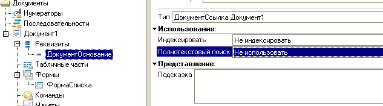
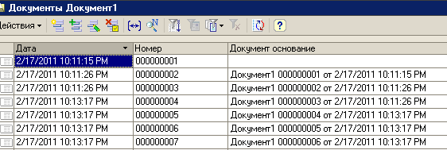
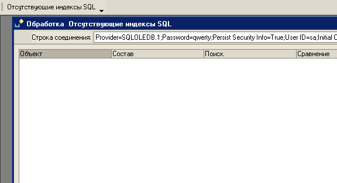
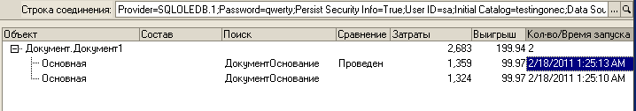

# Про отсутствующие индексы и 1С

**Хотите чтобы MS SQL подсказывал Вам, в каком объекте вы строите не оптимальные запросы или неверно спроектировали метаданные - тогда спросите у него это.**

**Вместо вступления:**

Чаще всего при общении с людьми мы так или иначе оцениваем их, относим их к различным категориям - причем категории мы создаем в принципе сами. Я думаю человеку удобней фиксировать свою оценку окружающих людей навешивая им ярлыки.

Причем те самые категории/ярлыки можно присвоить на основе того как ответит человек на тот или иной вопрос. Подтверждением тому (лично для меня), является например отношение к индексам базы данных.

Итак перед началом ознакомления со статьей хочу заметить, что на моем пути встречались следующие категории людей по типу отношения к индексам СУБД:

1. **Бог его знает что такое индекс** - отличительная особенность: круглые, удивленные глаза, как реакция на фразу “Запрос не попадает в индекс”.
1. **Каждое поле таблицы (реквизит объекта)** необходимо проанализировать на предмет необходимости индексации - отличительная особенность: постоянный просмотр планов запроса, даже в случае выборки одной строки из таблицы с гарантированным размером не более 10 строк.
1. **Вы слишком сильно уповаете на индексы** - отличительная особенность: гарантированная реакция с ярко выраженным апломбом, в виде “Оно вам не поможет”, при попытке коллеги просмотра административных представлений MS SQL или плана выполнения сложного запроса в терминах SQL
1. **С индексами в каждом конкретном случае надо включать голову** - компромиссный тип людей, отличительная особенность - знает что такое селективность, и понимает почему JOIN можно заменить на UNION и в чем будет выйгрыш.
 И последний момент который необходимо отразить: к кому себя относит автор ?

 Тут ответ прост - скорее к последнему типу, по причинам:

1. я считаю что про индексы надо знать
1. я знаю что анализировать необходимость индексов по полям таблицы необходимо, но не по всем полям, а на этапе 
проектирования только по основным, в дальнейшем по ситуации.
1. я знаю что не всегда индексы - это самая главная проблема производительности; также ведь есть код на 1С, есть не очень хорошее аппаратное обеспечение, блокировки и солнечные вспышки - и естественно мы знаем что у индексы есть такой хитрый параметр как избыточность.
1. я знаю различные инструменты мониторинга, и стараюсь по возможности не пренебрегать ни одним из них - и считаю что чем больше показателей информации - тем выше скорость диагностики конкретной проблемы

##  Для работы нам понадобиться:

- 1С Предприятие 8.2 - http://users.v8.1c.ru -  я использую версию 1С:Предприятие 8.2 (8.2.13.205)
- Тестовая конфигурация  - режим совместимости 8.1, архитектура: 1С Сервер + MS SQL 2005 и выше (я использую Microsoft SQL Server 2008 (RTM) - 10.0.1600.22 (X64))
- GameWithFire - http://main.1c-ei.ru/Articles/gamewithfire скачать можно по адресу http://dev.citykirov.ru/ или в составе Enterprise Integrator
- любую Консоль запросов 1С

## [Отсутствующие индексы](http://web.archive.org/web/20170628105124/)

Как не странно еще со времен 1С 7.7, мое желание запустить ее именно под MS SQL 2005 было связано, помимо всего прочего, еще и с тем фактом что сервер СУБД собирает статистику о выполнении запросов и предоставляет мне доступ к этой информации.

С появлением 1С 8.* ничего собственно не изменилось (за исключением того что теперь нет необходимости [учить 1С работать с MS SQL 2005](http://web.archive.org/web/20170628105124/)) - архитектура метаданных может оказаться не оптимальной, а запросы на языке 1С тоже - что вполне естественно: идеальных систем не существует в принципе.

Так вот - MS SQL хранит эту самую статистику и данная информация может быть очень даже полезной. Что это за статистика можно ознакомиться в относительно серьезной статье [“Открытие скрытых данных для оптимизации производительности приложений”](http://web.archive.org/web/20170628105124/)

Однако мы с Вами попробуем разобраться с одним из административных представлений MS SQL - а именно с **sys.dm_db_missing_index_***

Прежде чем мы начнем работать с этим представлением хочу заметить три основополагающих постулата применительно к нашей задаче:

- то что SQL считает отсутствующим индексом- это фиксация события когда
  - SQL строил план запроса - то как он будет собирать данные по запросу чтобы отдать нам в 1С,
  - в запросе был наложен фильтр явно или не явно (секция ГДЕ, СОЕДИНЕНИЕ и т.д.)
  - SQL “хотел” использовать индекс, но не нашел его.
- для анализа важны параметры Издержки индекса и Средний процент выигрыша, а это:
  - то какую **неоправданную нагрузку** Вы осуществляете на СУБД
  - что будет если вы создадите этот отсутствующий индекс - **на сколько сократятся ваши затраты**.
- Для того чтобы SQL больше не считал Ваши запросы не оптимальными и перестал “семафорить” о том, что он дескать не нашел нормально способа поиска по таблице - **исправлять Вы это должны на стороне 1С**

Сейчас попробуем на довольно простом примере убедиться что это очень просто:

### Тестовый пример

Для начала развернем тестовую конфигурацию приложенную к данной статье.

Развертывать необходимо в клиент-серверном режиме с использованием сервера СУБД MS-SQL версии 2005 и выше.

Метаданные в данном случае совершенно простейшие:



Однако обращаю внимание - реквизит ДокументОснование - НЕ проиндексирован. Я про него забыл ;-).

При запуске конфигурации будет запущен генератор документов - он создаст Вам сколько угодно документов. По умолчанию я выставляю 10000 документов

Генератор документов создает последовательно документы - в котором каждый следующий документ имеет основанием предыдущий по МоментуВремени документ такого же типа.



В конфигурацию встроена обработка **“Отсутствующие индексы SQL”**.

И сейчас она будет показывать пустую информацию (или ошибку если Вы забыли проинсталировать [GameWithFire.dll](http://web.archive.org/web/20170628105124/))


Давайте попробуем выполнить теперь несколько типовых запросов на выборку документа основания:

Открываем консоль запросов (причем я всем последнее время помимо **UCR** советую также [Консоль запросов с трассировкой](http://infostart.ru/public/56973/)), и выполняем набор простых запросов.

```
ВЫБРАТЬ  Документ1.Ссылка

ИЗ   Документ.Документ1 КАК Документ1

ГДЕ   Документ1.ДокументОснование = &ДокументОснование

;

 ВЫБРАТЬ  Документ1.Ссылка

ИЗ  Документ.Документ1 КАК Документ1

ГДЕ  Документ1.ДокументОснование = &ДокументОснование  И НЕ Проведен

;

 ВЫБРАТЬ  Документ1.Ссылка

ИЗ    Документ.Документ1 КАК Документ1

ВНУТРЕННЕЕ СОЕДИНЕНИЕ  Документ.Документ1 КАК Документ1Основание

        ПО Документ1.ДокументОснование =  Документ1Основание.Ссылка

;
```

И снова запускаем обработку “Отсутствующие индексы SQL”


А вот теперь в итоге посмотрите на запросы которые вы выполнили и на ту информацию которую Вам сообщил SQL:

**Итак Ваше приложение выполняло запросы которые:**

- осуществляли работу с основной таблицей документ с ИД “Документ1”
- вложенность не использовали (поле Состав предлагаемого индекса пустое)
- накладывали фильтры:
  - на равенство (поле Поиск) - по реквизиту ДокументОснование
  - на больше/меньше/НЕ равно - по реквизиту Проведен
- затраты на такие запросы сводно составили по этому документу 2683 “попугая” = [средняя стоимость одного запроса * средний процент  выйгрыша * (количество пользовательских операций поиска + количество пользовательских операций сканирования)]
- если бы вы создали подобный индекс вы бы сократили свои издержки на 99%

Так как поле Проведен недоступно для индексирования из 1С - Вы легко сделаете вывод сами, я надеюсь - **как исправить данную ситуацию**.

Отдельно хотел бы заметить - после  того как Вы вы выставите Индексацию у реквизита ДокументОснование - при выполнении тех же самых запросов - SQL уже не будет Вам сигнализировать о том “что кажется Вы забыли проиндексировать поля таблицы”.

### В качестве эпилога:

**Спасибо:**

1. **Кудякову Герману** - за пример использования формы подборы строки соединения SQL
1. **Дмитрию Ощепкову** за GameWithFire.
1. **Пользователям форума 1С++** - помимо старых статей про индексы в 1с 7.7 + DBF,  еще и за “Концепт ускорения регистров” 

**UPDATE 20110512:**
добавлены обработки для 8.1 и 8.2 поиска отсутствующих и избыточных индексов, с принятием решения о причине ошибки применительно к отсутствующим индексам и о решении об удалении применительно к избыточным индексам
обработки тестировались на 1С 8.1.15 и 8.2.13 с сервером MS SQL 2008 
запускались на конфигурациях: УПП, УТ 10, БП, ЗУП, Логистика 3.0, УТ 11, Розница. 

По итогам тестирования на конец дня 12 мая 2011:

**исправлено:**
ошибка при наличии отсутствующего индекса в ЖурналахДокументов - добавлен анализ Граф журнала
ошибка с определением индексированности реквизита в РегистрахСведений - добавлен анализ признака Ведущее

**выявлено к доработке:**
необходима документация и примеры по использованию обработки в отдельной публикации
необходимо исправить анализ индексов по РегистрамБухгалтерии 
необходимо группировать объекты в дерево на обоих панелях (Отсутствующие и избыточные индексы)
необходимо расширить принятие решения об удалении ИзбыточногоИндекса с "Удалить" на "Удалить индексацию реквизита"

**UPDATE 20110513**

**исправлено:**

"масштаб трагедии" теперь формируется в виде дерева на обоих панелях
обработка теперь не просто говорит "Удалить" избыточный индекс, но и на каком реквизите

**в работе:**

подготовка документации
анализ системных индексов регистра бухгалтерии по счетам

**UPDATE 20111014**

**новый функционал:**
попытка поиска ошибочного запроса и представление его в терминах 1С метаданных

**в работе:**
подготовка документации